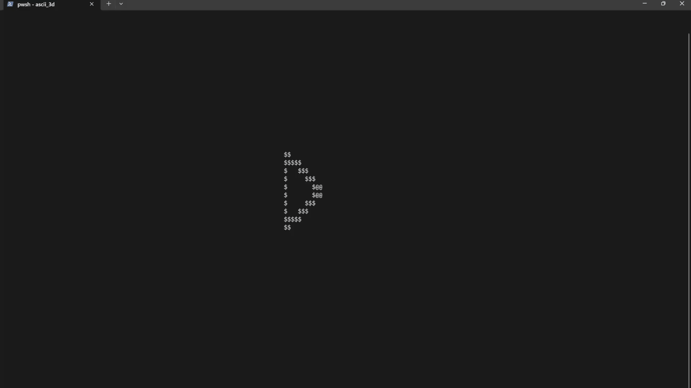

# ascii-3d


A very very very simple 3D renderer with ASCII. As of now, it simply:
1. Defines a triangle with three vertices
2. Conducts interpolation on the vertices to get intermediate points to be drawn.
3. Draws the triangle on screen through projection.
4. Rotates the triangle along a given origin, and re-computes (2.) and (3.).

## Usage
```bash
python renderer.py
```

## References
This project was inspired by the work done in [Donut Math](https://www.a1k0n.net/2011/07/20/donut-math.html).
- The perspective rendering, along with the use of the characters `.,-~:;=!*#$@` for 'illumination' were taken from there.
- Further, the math to compute rotations was taken from [this Wikipedia article](https://en.wikipedia.org/wiki/Rotation_matrix#General_rotations).

## TO-DO
- Comparing the implementation with the one in Donut Math, several optimisations could be made (e.g. precomputing sines and cosines).
- Rendering of larger geometric objects could be potentially done.
- Rotation is still a little buggy.
