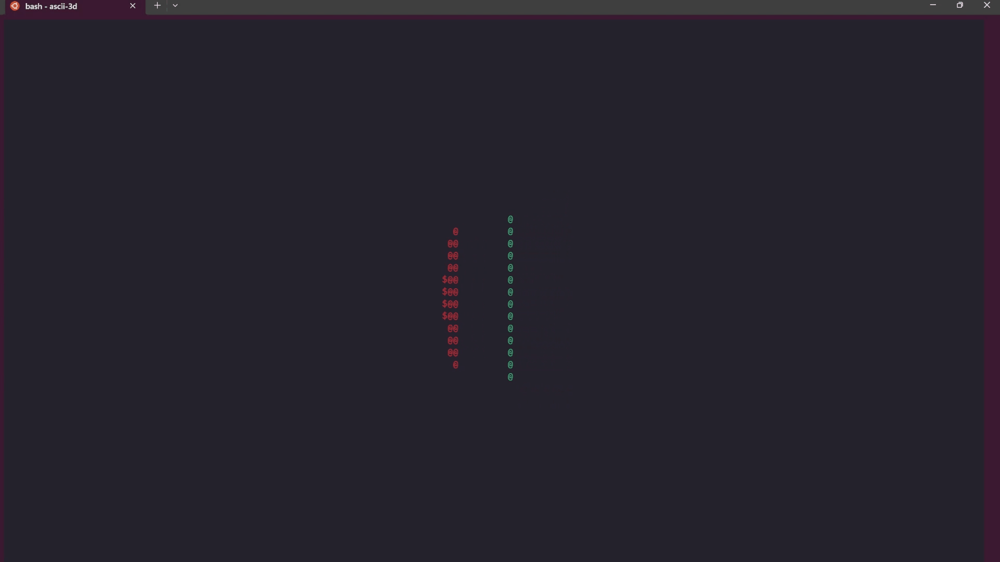

# ascii-3d


A very very very simple 3D renderer with ASCII. This only works on systems that support the Python [curses library](https://docs.python.org/3/library/curses.html#module-curses) (i.e. Unix systems).

As of now, it simply:
1. Defines a triangle and a quad.
2. Conducts interpolation on the vertices of both objects, to get intermediate vertices to be drawn.
3. Projects all vertices onto the screen (i.e. drawing them to the screen)
4. Rotates both the triangle and quad along their origins, and re-computes (2.), (3.).

## Usage
```bash
python renderer.py
```

## References
This project was inspired by the work done in [Donut Math](https://www.a1k0n.net/2011/07/20/donut-math.html).
- The perspective rendering, along with the use of the characters `.,-~:;=!*#$@` for 'illumination' were taken from there.
- Further, the math to compute rotations was taken from [this Wikipedia article](https://en.wikipedia.org/wiki/Rotation_matrix#General_rotations).

## TO-DO
- Rendering of larger geometric objects could be potentially done.
- Optimisation of surface rendering of intermediate points (should draw more for closer objects, less for further objects)
- Use of `itertools` for drawing of edges
